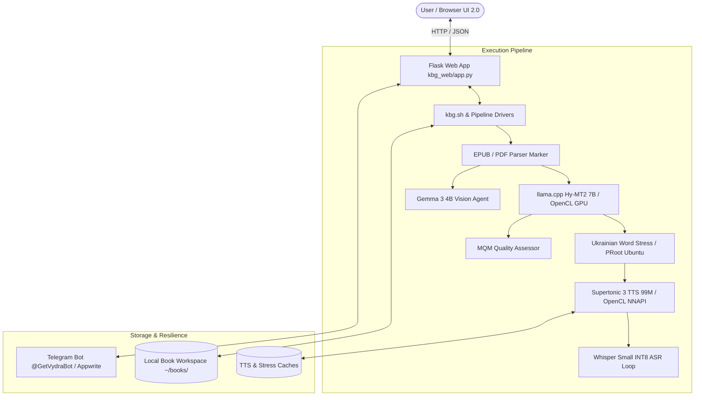

# 🦦 Vydra (kindle-butch-gen) — System Documentation

Welcome to the technical documentation hub for **Vydra** (`kindle-butch-gen`), an autonomous, offline-first pipeline and web interface for translating books & manga, generating neural audiobooks, and performing AI-driven visual/linguistic quality editing natively on Android (Termux) hardware.

---

## 🗺️ Documentation Directory Index

| Section | Description | Target Audience |
|---|---|---|
| **[🇺🇦 Документація українською](uk/README.md)** | Повнотекстовий посібник користувача, встановлення, бот та інструкції UI 2.0 | Користувачі та оглядачі |
| **[System Architecture](architecture.md)** | Technical design, pipeline stages, hardware acceleration, memory model, and resiliency | Engineers & Architects |
| **[REST API Reference](api.md)** | Endpoint definitions, request/response schemas, authentication, and status codes | Developers & Integrators |
| **[CLI Reference](cli.md)** | Complete guide to `kbg.sh`, model management scripts, and system diagnostics | Power Users & Sysadmins |
| **[Termux:Boot Setup](deployment/termux-boot-setup.md)** | Automated boot configuration and background process resilience | System Administrators |
| **[Legal & Licenses](uk/legal.md)** | Usage terms, copyright guidelines, third-party component licenses, and disclaimers | Legal & Compliance |

---

## 📐 System Architecture Overview



---

## ✨ Key Technical Capabilities

1. **Neural Audiobooks (Supertonic 3)**:
   - Flow Matching synthesis with 10 Ukrainian voices (`0` to `9`).
   - OpenCL / Android NNAPI hardware acceleration.
   - Dynamic paragraph-level caching (`tts_cache_supertonic-3-tts-int8.json`) and stress tag caching (`stress_cache_uk.json`).

2. **ASR Accent Verification (Whisper Small INT8)**:
   - Automated speech-to-text verification using ONNX Runtime.
   - Detects pronunciation discrepancies and flags stress errors for human or automated correction.

3. **MQM Translation Quality Assessment**:
   - Multidimensional Quality Metrics evaluation scoring translated paragraphs on accuracy, fluency, and semantic preservation.

4. **Gemma 3 4B Agent-Editor**:
   - Vision-capable AI editor utilizing `gemma-3-4b-it` and `mmproj-model-f16` to inspect complex manga pages and formatted text.
   - Generates visual "Before / After" edit proposals in the `Pending Edits` queue requiring explicit user consent.

5. **Modern Web UI 2.0**:
   - OLED dark-mode responsive dashboard with live progress indicators.
   - Per-book granular settings modal (`enable_asr_verify`, `enable_mqm_review`, `enable_agent_editor`).
   - Automated model verification and interactive download consent dialogs over Wi-Fi.

---

## 🛠️ Quick Commands Overview

```bash
# Add a new EPUB/PDF book
./kbg.sh add --slug my-book --pdf /path/to/book.pdf --title "My Book" --authors "Author" --lang uk

# Execute full pipeline (Extract -> Translate -> Stress -> TTS -> ASR -> Pack)
./kbg.sh run my-book

# Launch Web Dashboard on port 5000
./kbg.sh serve --port 5000

# Download Premium AI Models (ASR Whisper & Gemma 3)
./bin/download_premium_models.sh --target all
```
