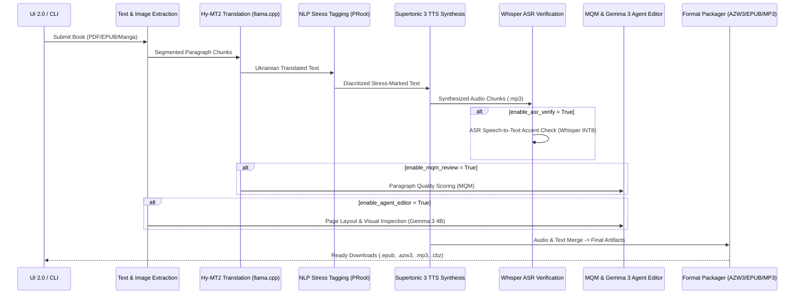

# System Architecture — Vydra (`kindle-butch-gen`)

Vydra is architected as an offline-first, high-resilience pipeline engineered specifically for mobile hardware running under Android (Termux). It splits heavy computational workloads between native ARM64 binaries (accelerated by OpenCL/NNAPI) and an isolated Ubuntu 24.04 LTS container running under PRoot.

---

## 🏛️ System Layers & Component Topology

```
+-------------------------------------------------------------------+
|                        Web UI 2.0 (Flask)                         |
|   Dashboard | Quality Visualizer | Per-Book Settings | Downloads   |
+-------------------------------------------------------------------+
                                  |
                                  v
+-------------------------------------------------------------------+
|                     Pipeline Controller (kbg.sh)                  |
|    Job Scheduler | Resumability State Engine | Model Consent      |
+-------------------------------------------------------------------+
         |                                           |
         v                                           v
+-----------------------------+             +-----------------------+
|  Native Termux Environment  |             | PRoot Ubuntu 24.04    |
|                             |             |                       |
| - llama.cpp (Hy-MT2 7B)     |             | - Stanza NLP Engine   |
|   [OpenCL GPU Accelerated]  |             | - ukrainian_word_stress|
|                             |             | - Calibre (ebook-convert)|
| - Supertonic 3 TTS (99M)    |             | - Marker PDF Extractor|
|   [NNAPI / NEON CPU Hybrid] |             +-----------------------+
|                             |
| - Sherpa ONNX ASR           |
|   [Whisper Small INT8]      |
|                             |
| - Gemma 3 4B Vision Agent   |
|   [Q4_K_M GGUF + mmproj]    |
+-----------------------------+
```

---

## ⚙️ Processing Stages & Pipeline Sequence

The processing pipeline is modularized across `translate_epub.py`, `translate_manga.py`, and `audio_stage.py`. Each stage enforces atomic checkpointing to allow seamless recovery from interruptions.



---

## 🔋 Hardware Allocation & Thermal Safety

1. **CPU Thread Allocation Strategy**:
   - Modern ARM big.LITTLE architectures (e.g. Snapdragon 8 Gen 2/3, 8-core CPUs) are managed dynamically:
   - When active cooling (magnetic cooler) is detected or enabled, Vydra utilizes **6 of 8 cores** for OCR and packaging.
   - When passive cooling is active, thread count is capped to prevent thermal throttling and battery degradation.

2. **Hybrid Acceleration Model**:
   - **llama.cpp**: OpenCL GPU acceleration for the 7B translation model (`Hy-MT2-7B-Q4_K_M.gguf`).
   - **Supertonic 3 TTS**:
     - `duration_predictor`, `text_encoder`, `vector_estimator` -> Accelerated on Adreno GPU via Android **NNAPI Execution Provider**.
     - `vocoder` -> 4-thread CPU NEON execution provider.
   - **Whisper ASR**:
     - `small-encoder.int8.onnx` (112 MB) & `small-decoder.int8.onnx` (262 MB) -> Processed natively via ONNX Runtime CPU INT8 execution.

---

## 💾 Resiliency & State Management

- **Dynamic Paragraph Caching**: Generated audio chunks are persisted immediately to `tts_cache_supertonic-3-tts-int8.json`. Upon restart, existing keys are bypassed in $O(1)$ time.
- **NLP Stress Caching**: Morphological stress analysis results are stored in `stress_cache_uk.json`. Bypasses PRoot Ubuntu NLP invocations on rebuilds.
- **Process Supervision**:
  - `termux-wake-lock` holds Android `PARTIAL_WAKE_LOCK`.
  - Auto-restart logic monitored by `kbg-autoresume.log` and `Termux:Boot`.
