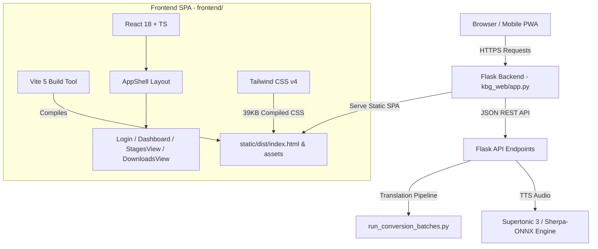

# 🚀 Master Handoff: Vydra Studio UI Redesign & Architecture

## 📋 Table of Contents
1. [Overview & Collaboration Strategy](#1-overview--collaboration-strategy)
2. [File System & Research Artifact Map](#2-file-system--research-artifact-map)
3. [Framework Architecture & Technology Stack](#3-framework-architecture--technology-stack)
4. [Deployment Environments & Access Credentials](#4-deployment-environments--access-credentials)
5. [Current Development Progress & Remaining Tasks](#5-current-development-progress--remaining-tasks)
6. [Collaborative Workflow Rules & Commands](#6-collaborative-workflow-rules--commands)

---

## 1. Overview & Collaboration Strategy

This document serves as the canonical handoff for **Claude Code CLI** operating on **OnePlus 13 (Termux)** and **dev-184**, working in pair-programming collaboration with **Antigravity AI**.

### Core Objective
Transform **Vydra Studio** (`kindle-butch-gen`) — a local book translation and audio synthesis suite — from legacy Flask Jinja2 HTML templates into a high-performance, responsive **React 18 + Vite SPA** powered by the **Astryx Design System** ("Emerald Slate Studio") and Tailwind CSS v4.

---

## 2. File System & Research Artifact Map

All foundational architectural research, API contracts, design tokens, and migration plans have been compiled into dedicated files across `dev-184` and `OnePlus 13`:

### 📚 Primary Research & Master Plans
- **Master Migration Plan**:  
  [`/home/vokov/agy-work/kindle-butch-gen-research/docs/plans/astryx-ui-migration/README.md`](file:///home/vokov/agy-work/kindle-butch-gen-research/docs/plans/astryx-ui-migration/README.md)
- **Component Mapping Specification** (Jinja2 HTML → React Components):  
  [`/home/vokov/agy-work/kindle-butch-gen-research/docs/plans/astryx-ui-migration/component-mapping.md`](file:///home/vokov/agy-work/kindle-butch-gen-research/docs/plans/astryx-ui-migration/component-mapping.md)
- **Flask REST API ↔ React SPA Contract**:  
  [`/home/vokov/agy-work/kindle-butch-gen-research/docs/plans/astryx-ui-migration/api-contract.md`](file:///home/vokov/agy-work/kindle-butch-gen-research/docs/plans/astryx-ui-migration/api-contract.md)
- **Design System Spec ("Emerald Slate Studio")**:  
  [`/home/vokov/agy-work/kindle-butch-gen-research/docs/plans/astryx-ui-migration/design-system-and-plan.md`](file:///home/vokov/agy-work/kindle-butch-gen-research/docs/plans/astryx-ui-migration/design-system-and-plan.md)
- **UI Spacing & Layout Handoff**:  
  [`/home/vokov/.gemini/antigravity-cli/brain/2ff541f3-8305-4c79-98a9-36df1c1d4c0f/hand-off_ui_redesign.md`](file:///home/vokov/.gemini/antigravity-cli/brain/2ff541f3-8305-4c79-98a9-36df1c1d4c0f/hand-off_ui_redesign.md)
- **Full Codebase Analysis Report**:  
  [`/home/vokov/.gemini/antigravity-cli/brain/2ff541f3-8305-4c79-98a9-36df1c1d4c0f/analysis_report.md`](file:///home/vokov/.gemini/antigravity-cli/brain/2ff541f3-8305-4c79-98a9-36df1c1d4c0f/analysis_report.md)

### 📓 NotebookLM MCP Notebooks
- **Astryx Design System Notebook**: ID `ace65e5c-a580-494b-b352-a25920c16a48` (150+ Astryx React components, StyleX specs, SSR rules).
- **KBG Redesign Notebook**: ID `0c18b603-73d7-44ba-bc44-34bfe8080327` (Vydra requirements & pipeline features).

---

## 3. Framework Architecture & Technology Stack



### Key Technical Details
1. **Frontend**: React 18, Vite 5, Tailwind CSS v4 (`@tailwindcss/vite`), TypeScript, Lucide Icons, React Router v6.
2. **Backend**: Python 3.11 + Flask serving static SPA output (`kbg_web/static/dist`) via `_serve_spa_or_template()` with `@app.route('/<path:path>')` handling JS/CSS asset passthrough.
3. **Build Target**: `frontend/vite.config.ts` outputs bundle directly to `../kbg_web/static/dist`.
4. **Thermal Throttling Guard**: `run_conversion_batches.py` respects `inter_batch_cooldown_seconds` (300s default on Termux) between 50-page chunks to prevent Android process kills.

---

## 4. Deployment Environments & Access Credentials

### 📱 OnePlus 13 (Termux Android Host)
- **Local/WiFi Host**: `192.168.3.196` (Port `8022`)
- **External Host**: `188.163.44.137` (Port `8022`)
- **SSH User / Password**: `u0_a438` / `0523`
- **Repo Directory**: `~/kindle-butch-gen/`
- **Installed Agent**: `Claude Code CLI 2.1.220`
- **Live Web Interface**: `https://kindle.exodus.pp.ua`
- **Web App Credentials**: `vokov` / `0523` (or `admin` / `0523`)

### 🖥️ dev-184 (Primary Development Host)
- **Workspace Path**: `/home/vokov/agy-work/kindle-butch-gen-research/`
- **GitHub Repository**: `maxfraieho/kindle-butch-gen` (Branch: `master`)

---

## 5. Current Development Progress & Remaining Tasks

### ✅ Completed
- [x] Initialized React 18 + Vite SPA in `frontend/`.
- [x] Configured Tailwind CSS v4 compiler plugin (`@tailwindcss/vite`).
- [x] Implemented "Emerald Slate Studio" design system (`#090d16` base, `#10b981` emerald accent, `#131c2e` card surfaces).
- [x] Created responsive `AppShell` with Desktop Sidebar (≥ 768px) and Mobile Floating Bottom Dock (< 768px).
- [x] Created UI primitives (`Button`, `Card`, `Badge`, `ProgressBar`, `Modal`).
- [x] Implemented `Login.tsx` with absolute icon alignment (`pl-11 pr-4`).
- [x] Implemented `Dashboard.tsx` with live 4s status polling, safe progress math, and interactive `AddBookModal`.
- [x] Integrated Flask static asset SPA fallback in `kbg_web/app.py`.
- [x] Pushed build bundle to GitHub and deployed live on OnePlus 13.

### 🚧 Pending Implementation Tasks
1. **`MangaEditor.tsx`**:
   - Triptych view (original page, extracted OCR bubbles overlay, translated Ukrainian text).
   - In-place text bubble editing and canvas preview rendering.
2. **`SettingsView.tsx`**:
   - Supertonic 3 voice model selection & playback speed.
   - Local `llama-server` model switching (Gemma 3 / Qwen / Mistral).
   - Thermal throttling cooldown configuration (`inter_batch_cooldown_seconds`).
3. **`CharacterEditor.tsx`**:
   - Cast Registry CRUD interface (character names, gender, voice pitch profiles).
4. **PWA Mobile Polish**:
   - Add Web App Manifest and Service Worker for offline PWA caching on OnePlus 13.

---

## 6. Collaborative Workflow Rules & Commands

### 🔄 Sync & Build Loop
When making changes on `dev-184` or `OnePlus 13`:

1. **Build Frontend**:
   ```bash
   cd ~/kindle-butch-gen/frontend && npm run build
   ```
2. **Commit & Push**:
   ```bash
   git add frontend/ kbg_web/static/dist/
   git commit -m "feat(ui): implement new view"
   git push origin master
   ```
3. **Update & Restart Flask on OnePlus 13 over SSH**:
   ```bash
   sshpass -p '0523' ssh -p 8022 u0_a438@192.168.3.196 "cd ~/kindle-butch-gen && rm -rf kbg_web/static/dist && git pull origin master && killall python3 2>/dev/null || pkill -9 python 2>/dev/null || true && nohup python3 kbg_web/app.py --port 5000 > ~/kbg-flask.log 2>&1 &"
   ```

4. **Verify Live App**:
   - Check `curl -s http://192.168.3.196:5000/` or inspect via `agent-workspace` / browser DevTools.

---

*Handoff prepared by Antigravity AI for Claude Code CLI collaboration.*
